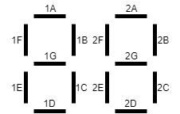

# arduinoledmask
Neutrogena LED mask Arduino MOD

### LCD PIN List 

REF:[GDC02693](http://www.e-paper-display.cn/downloadRepository/7cf0ef04-cbe3-46a2-a5f3-99384003f70b.pdf)
#  
|PIN |  1|  2|  3|  4|   5|   6|   7|   8|
|:---|:--|:--|:--|:--|:---|:---|:---|:---|
|COM1| 1D| 1E| 1F| 1A|    |    |    |COM1|
|COM2|   | 1C| 1G| 1B|    |    |COM2|    |
|COM3| 2D| 2E| 2F| 2A|    |COM3|    |    |
|COM4|   | 2C| 2G| 2B|COM4|    |    |    |
